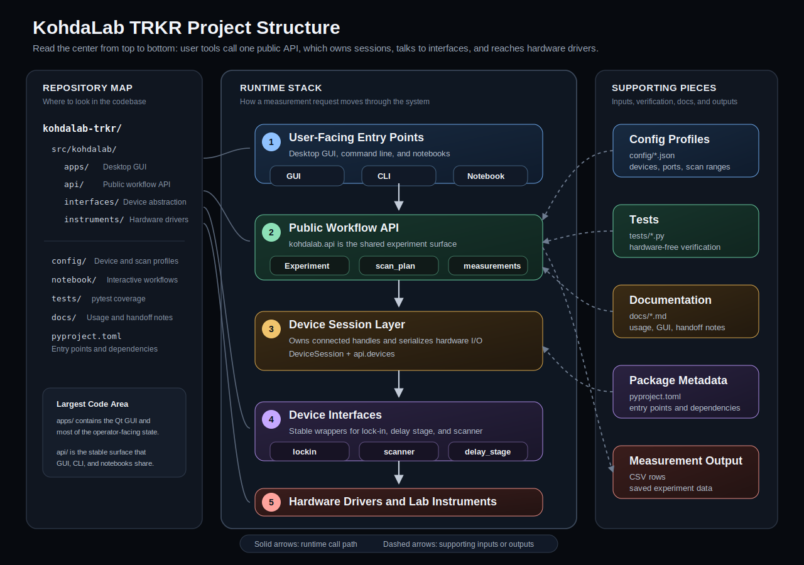

KohdaLab-TRKR
=============

KohdaLab-TRKR is organized around a small public API for laboratory control.

For practical examples, see `docs/api_usage.md`.

Project Structure
-----------------



Measurement sequence diagrams:

- [Overview](docs/measurement_sequences.md)
- [Signal Monitor](docs/measurement-sequence-signal-monitor.svg)
- [TRKR](docs/measurement-sequence-trkr.svg)
- [SRKR](docs/measurement-sequence-srkr.svg)
- [STRKR](docs/measurement-sequence-strkr.svg)
- [SRKR 2D](docs/measurement-sequence-srkr-2d.svg)

Quick Start (日本語)
-------------------

新しい PC で GUI 測定を始めるための標準手順です。Windows PowerShell を使います。
ここでは標準の置き場所を `C:\pythonKernel\kohdalab-trkr` とします。別の場所に置く
場合は、以降の `$repo` と folder path だけ読み替えてください。

### 1. 事前準備: Git をインストールして GitHub にログイン

Git は Windows のコマンドライン package manager で入れます。

```powershell
winget install --id Git.Git -e --source winget
```

インストール後、新しい PowerShell を開いて確認します。

```powershell
git --version
```

commit する PC では、名前とメールアドレスも一度だけ設定します。

```powershell
git config --global user.name "Your Name"
git config --global user.email "your-email@example.com"
```

GitHub へのログインは、private repo に初めてアクセスすると Git Credential Manager
がブラウザログインを出します。先に確認したい場合は、次のコマンドを実行して、
ログイン画面が出たら GitHub アカウントで認証してください。

```powershell
git ls-remote https://github.com/Kohdalab/kohdalab-trkr.git
```

### 2. 事前準備: uv をインストール

uv は Python 環境を作るために使います。

```powershell
powershell -ExecutionPolicy ByPass -c "irm https://astral.sh/uv/install.ps1 | iex"
```

インストール後、新しい PowerShell を開いて確認します。

```powershell
uv --version
```

uv の公式 install docs:

```text
https://docs.astral.sh/uv/getting-started/installation/
```

### 3. GitHub repo を取得

```powershell
New-Item -ItemType Directory -Force -Path C:\pythonKernel
Set-Location C:\pythonKernel
git clone https://github.com/Kohdalab/kohdalab-trkr.git kohdalab-trkr
Set-Location kohdalab-trkr
```

`C:\pythonKernel` の作成で権限エラーが出る PC では、最初の 2 行だけ以下に置き換えます。

```powershell
New-Item -ItemType Directory -Force -Path $HOME\pythonKernel
Set-Location $HOME\pythonKernel
```

すでに zip や USB で repo folder を持ってきた場合は、その folder に移動すれば OK です。

### 4. 依存環境を作成

GUI と notebook も使う通常セットアップ:

```powershell
uv sync --all-extras
```

開発や test も行う PC では:

```powershell
uv sync --all-extras --group dev
```

uv を使う場合は、基本的に `.venv` を手動で activate せず、`uv run ...` で起動します。

### 5. 実機 PC に必要な外部 driver を確認

Python package とは別に、実機 PC 側に以下が必要です。

- NI-VISA または Keysight VISA などの VISA runtime
- delay stage / scanner 用の USB serial driver
- Windows の Device Manager で COM port が見えること
- lock-in の GPIB/VISA resource が見えること

### 6. GUI を起動

```powershell
uv run kohdalab-gui
```

その PC 用に config を編集する場合は、Git 管理されている `config\default.json` を直接上書きせず、
先にローカル用ファイルへコピーします。`config\*.local.json` は Git 管理外なので、`git pull` で上書きされません。

```powershell
Copy-Item config\default.json config\kikuchi.local.json
```

GUI が起動したら:

1. `Load` で `config\kikuchi.local.json` を開いて確認します。
2. Lock-in resource と各 COM port を `Refresh` して選び直します。
3. `Save` でその PC 用の config に保存します。
4. `Connect All` または個別 `Connect` で接続します。
5. `Read Live` で live status が更新されることを確認します。
6. 小さい範囲で `Signal Monitor`、`TRKR`、`SRKR`、`STRKR`、`SRKR 2D` を試します。

実機確認 checklist は `docs/hardware_smoke_test_ja.md` を使ってください。

### 7. CLI / notebook も使えます

CLI:

```powershell
uv run kohdalab-cli --config config\kikuchi.local.json trkr
```

Notebook:

```powershell
uv run jupyter lab
```

maintained notebooks:

- `notebook/move_abs_notebook.ipynb`
- `notebook/signal_monitor_notebook.ipynb`
- `notebook/trkr_notebook.ipynb`
- `notebook/srkr_notebook.ipynb`
- `notebook/strkr_notebook.ipynb`
- `notebook/srkr_2d_notebook.ipynb`

GUI は安全のため `auto_connect=False` で、先に明示接続してから測定します。CLI と notebook は既定で `auto_connect=True` なので、必要 device を自動接続しに行きます。

### 8. デスクトップショートカットを作成

PowerShell で repo の場所を指定して、GUI 起動用の `.bat` とデスクトップショートカットを作ります。
repo を別の場所に置いた場合は、最初の `$repo` だけ変更してください。

`start_kohdalab_gui.bat` の中身:

```bat
@echo off
cd /d "C:\pythonKernel\kohdalab-trkr"
uv run kohdalab-gui
pause
```

作成後は、デスクトップの `KohdaLab TRKR` をダブルクリックすると GUI が起動します。

### 9. 最新版に更新する

基本はこの 4 つです。

```powershell
Set-Location C:\pythonKernel\kohdalab-trkr

git status
git pull --ff-only
uv sync --all-extras
uv run kohdalab-gui
```

`git status` で `working tree clean` ならそのまま更新できます。`uv sync --all-extras` は、最新版で依存パッケージが変わった場合に `.venv` を合わせるためです。

PC ごとの設定は `config\*.local.json` に保存してください。このファイルは Git 管理外なので、
`git pull` では上書きされません。

デスクトップショートカットは、同じ `C:\pythonKernel\kohdalab-trkr` を使っている限り作り直さなくて大丈夫です。中で `uv run kohdalab-gui` を実行するだけなので、更新後の最新版が起動します。

Quick Start (English)
---------------------

This is the standard setup path for starting GUI measurements on a new PC. The
commands assume Windows PowerShell. The standard location used below is
`C:\pythonKernel\kohdalab-trkr`; if you use another folder, replace `$repo` and the
folder paths accordingly.

### 1. Prerequisite: install Git and sign in to GitHub

Install Git from the command line with Windows Package Manager.

```powershell
winget install --id Git.Git -e --source winget
```

Open a new PowerShell and verify the install:

```powershell
git --version
```

On PCs that will create commits, set the Git identity once:

```powershell
git config --global user.name "Your Name"
git config --global user.email "your-email@example.com"
```

Git Credential Manager opens a browser sign-in the first time Git needs access
to a private GitHub repository. To trigger that check before cloning, run:

```powershell
git ls-remote https://github.com/Kohdalab/kohdalab-trkr.git
```

### 2. Prerequisite: install uv

uv is used to create and run the Python environment.

```powershell
powershell -ExecutionPolicy ByPass -c "irm https://astral.sh/uv/install.ps1 | iex"
```

Open a new PowerShell and verify the install:

```powershell
uv --version
```

Official uv installation docs:

```text
https://docs.astral.sh/uv/getting-started/installation/
```

### 3. Clone the GitHub repository

```powershell
New-Item -ItemType Directory -Force -Path C:\pythonKernel
Set-Location C:\pythonKernel
git clone https://github.com/Kohdalab/kohdalab-trkr.git kohdalab-trkr
Set-Location kohdalab-trkr
```

If creating `C:\pythonKernel` fails because of permissions, replace only the first
two lines with:

```powershell
New-Item -ItemType Directory -Force -Path $HOME\pythonKernel
Set-Location $HOME\pythonKernel
```

If the repository was copied by zip or USB storage, just open PowerShell in
that folder instead.

### 4. Create the Python environment

Standard setup for GUI and notebooks:

```powershell
uv sync --all-extras
```

For development and tests:

```powershell
uv sync --all-extras --group dev
```

When using uv, usually do not activate `.venv` manually. Start commands with
`uv run ...` instead.

### 5. Install hardware drivers on the instrument PC

Python dependencies are not enough for real hardware. The instrument PC also
needs:

- NI-VISA, Keysight VISA, or another working VISA runtime
- USB serial drivers for the delay stage and scanners
- visible COM ports in Windows Device Manager
- visible GPIB/VISA resources for the lock-in

### 6. Start the GUI

```powershell
uv run kohdalab-gui
```

For PC-specific settings, copy the tracked default config to a local config
first. `config\*.local.json` is ignored by Git, so `git pull` will not overwrite
it.

```powershell
Copy-Item config\default.json config\kikuchi.local.json
```

After the GUI opens:

1. Open `config\kikuchi.local.json` with `Load` and check the config.
2. Use `Refresh` to select the lock-in resource and COM ports for this PC.
3. Save the PC-specific config with `Save`.
4. Connect devices with `Connect All` or individual `Connect` buttons.
5. Use `Read Live` to confirm live status updates.
6. Start with small ranges for `Signal Monitor`, `TRKR`, `SRKR`, `STRKR`, and
   `SRKR 2D`.

Use `docs/hardware_smoke_test.md` for the hardware verification checklist.

### 7. CLI and notebooks are also available

CLI:

```powershell
uv run kohdalab-cli --config config\kikuchi.local.json trkr
```

Notebook:

```powershell
uv run jupyter lab
```

Maintained notebooks:

- `notebook/move_abs_notebook.ipynb`
- `notebook/signal_monitor_notebook.ipynb`
- `notebook/trkr_notebook.ipynb`
- `notebook/srkr_notebook.ipynb`
- `notebook/strkr_notebook.ipynb`
- `notebook/srkr_2d_notebook.ipynb`

The GUI uses `auto_connect=False` for safety, so devices must be explicitly
connected before a measurement starts. CLI and notebooks use
`auto_connect=True` by default and may connect required devices automatically.

### 8. Create a desktop shortcut

Create `start_kohdalab_gui.bat` with this content:

```bat
@echo off
cd /d "C:\pythonKernel\kohdalab-trkr"
uv run kohdalab-gui
pause
```

Create a desktop shortcut to that `.bat` file. After this, double-click the
shortcut to start the GUI.

Layering
--------

The intended dependency direction is:

1. `kohdalab.instruments`
   Low-level device drivers. These modules talk directly to VISA, serial,
   sockets, or vendor-specific command sets.

2. `kohdalab.interfaces`
   Device-level control APIs. These modules normalize controller differences,
   units, limits, connection reuse, and convenience operations.

3. `kohdalab.api`
   Public workflow API. Notebook, GUI, CLI, and future app code should call
   this layer. `Experiment` owns config, device sessions, live status, moves,
   and measurement runs.

4. `kohdalab.apps`
   User-facing applications. Apps should stay thin and delegate device and
   measurement behavior to `kohdalab.api`.

Design Notes
------------

- Keep dependencies flowing downward only: apps/notebooks -> api ->
  interfaces -> instruments.
- Scanner interfaces use each actuator's native `pos_unit` such as mm or deg.
  SRKR APIs expose sample positions in um, while TRKR APIs expose delay
  positions in ps.
- Measurement scans choose the input layer with `coordinate`: `measurement` or
  `interface` for new scanner/SRKR code, with `instrument` still accepted as a
  compatibility alias. For TRKR these correspond to ps, stage mm, and pulse.
  For SRKR, `measurement` is sample um and `interface` is scanner actuator
  mm/deg.
- Scanner sample conversion is configured with `sample_um_per_unit`.
- Hardware home/origin belongs to the control layer. Measurement coordinates
  use the middle of each device's min/max travel as zero. For example,
  TRA12CC `0-12 mm` maps `x_um = 0` to `scanner_mm = 6.0`, and TRKR uses the
  middle of the delay-stage travel as `t_ps = 0`.
- Keep instrument-specific command quirks in `instruments`.
- Put reusable UI-independent orchestration in `api` so notebooks, GUI, CLI,
  and future apps can share the same behavior.

Python API
----------

```python
from kohdalab.api import Experiment, load_config, trkr_plan_from_config

config = load_config("config/kikuchi.local.json")
experiment = Experiment(config)
experiment.connect_all()
status = experiment.read_live_status()
experiment.move_delay_stage(0.0, coordinate="measurement")
plan = trkr_plan_from_config(config)
rows = experiment.run_trkr(plan=plan)
experiment.disconnect_all()
```

CLI fallback
------------

The everyday GUI entry point is `kohdalab-gui`. The same measurement runners
can also be started from a terminal:

For post-change hardware verification, use `docs/hardware_smoke_test.md`.

```powershell
kohdalab-cli --config config\kikuchi.local.json signal-monitor
kohdalab-cli --config config\kikuchi.local.json trkr
kohdalab-cli --config config\kikuchi.local.json srkr --axis x
kohdalab-cli --config config\kikuchi.local.json strkr --fast-axis t --slow-axis x
kohdalab-cli --config config\kikuchi.local.json srkr-2d --fast-axis x --slow-axis y
kohdalab-cli --config config\kikuchi.local.json move-abs --axis x --coordinate measurement --value 10
```

If the package script is not installed, run the module directly:

```powershell
$env:PYTHONPATH='src'
uv run python -m kohdalab.api.cli --config config\kikuchi.local.json trkr
```

The CLI prints start/status/point progress, writes measurement rows to the
output path configured for each measurement, prints the final saved path, and
prints errors to stderr. It keeps the notebook/CLI-friendly behavior of
`Experiment`, including automatic connection of devices used by the command.

Notebook entry points
---------------------

The maintained notebooks are:

- `notebook/move_abs_notebook.ipynb`
- `notebook/signal_monitor_notebook.ipynb`
- `notebook/trkr_notebook.ipynb`
- `notebook/srkr_notebook.ipynb`
- `notebook/strkr_notebook.ipynb`
- `notebook/srkr_2d_notebook.ipynb`

These notebooks, `kohdalab-cli`, and `kohdalab-gui` all call the same
`kohdalab.api.Experiment` facade and measurement plan builders.
